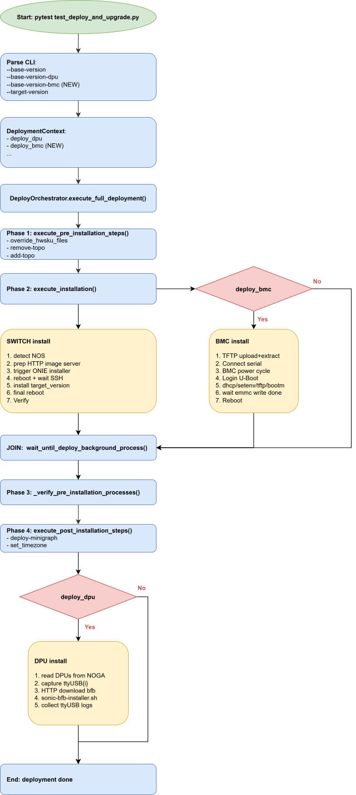

---
# 1. Background
BMC (Baseboard Management Controller) is a dedicated microcontroller embedded on a server's motherboard that provides out-of-band (OOB) management — meaning it works independently of the main CPU, OS, and even the server's power state.

Key Characteristics
- Independent subsystem: Has its own processor, memory, firmware, and network interface (dedicated management port)
- Always on: Runs on standby power; accessible even when the host is powered off
- Out-of-band: Does not rely on the host OS or production network


---
# 2. Document
- SONiC BMC Introduction: https://nvidia.atlassian.net/wiki/spaces/SW/pages/3085868022/Sonic+BMC+introduction
- SONiC BMC Installation: https://nvidia.atlassian.net/wiki/spaces/SW/pages/3239673921/BMC+SONiC
- Installation PR: https://github.com/sonic-net/sonic-buildimage/pull/26851


---
# 3. Proposed Flow (parallel switch + BMC)



---
# 4. CLI / Parameter Changes

New pytest options (`ngts/scripts/sonic_deploy/conftest.py`)
``` python
parser.addoption("--base-version-bmc", action="store", default="",
                help="URL or path to the SONiC BMC image tarball "
                    "(contains sonic_tftp_install.fit + sonic-aspeed-arm64-emmc.img.gz). "
                    "When empty, BMC install is skipped.")
parser.addoption("--bmc-tftp-server", action="store", default="",
                help="TFTP server IP used by BMC U-Boot to fetch the BMC image. "
                    "Defaults to the test-server IP resolved from setup_info.")
```


Corresponding fixtures:
``` python
@pytest.fixture(scope="session")
def base_version_bmc(request):
    return request.config.getoption('--base-version-bmc')

@pytest.fixture(scope="session")
def deploy_bmc(base_version_bmc, platform_params):
    """Deploy BMC only when the user provided a BMC image AND the platform supports BMC."""
    return bool(base_version_bmc) and _platform_supports_bmc(platform_params)
```


---
# 5. Code Changes

## 5.1 DeployOrchestrator.execute_full_deployment()
``` python
def execute_full_deployment(self):
    results = {}

    with allure.step('pre installation steps'):
        results['pre_install_threads'] = self.execute_pre_installation_steps()

    with allure.step('installation (switch + BMC in parallel)'):
        # Switch install — existing code path
        results['install_threads'] = self.execute_installation()

        # BMC install — NEW, only when deploy_bmc is True
        bmc_threads = []
        if self.context.deploy_bmc:
            bmc_threads = self.execute_bmc_image_installation()

        # Join both
        self.wait_until_deploy_background_process(results['install_threads'], timeout=1500)
        if bmc_threads:
            self.wait_until_deploy_background_process(bmc_threads, timeout=1800)

    with allure.step('verify pre installation processes are done'):
        self._verify_pre_installation_processes(results['pre_install_threads'])

    with allure.step('post installation steps'):
        self.execute_post_installation_steps()
        ...

    if self.context.deploy_dpu:
        self.execute_dpu_image_installation()
        self.execute_dpu_post_installation_steps()

    return results
```

## 5.2 New helper: DeployBmcHelper (in deploy_helper_methods.py)
``` python
class DeployBmcHelper:
    """Handle BMC-specific deployment operations over serial + TFTP."""

    @staticmethod
    def install_bmc(topology_obj, base_version_bmc, tftp_server_ip,
                    dut_alias, dut_name, setup_name):
        """
        Entry point for one BMC install.
        Idempotent per-DUT; safe to call concurrently for multi-DUT setups.
        """
        bmc_info = DeployBmcHelper._prepare_bmc_info(topology_obj, dut_alias)
        with allure.step(f'Stage BMC image on TFTP server: {base_version_bmc}'):
            DeployBmcHelper._stage_tftp_payload(tftp_server_ip, base_version_bmc)

        serial = DeployBmcHelper._open_serial(bmc_info)       # rcon session
        try:
            with allure.step(f'Power cycle BMC on {dut_name}'):
                DeployBmcHelper._power_cycle_bmc(bmc_info)

            with allure.step('Break into U-Boot'):
                DeployBmcHelper._wait_for_uboot_prompt(serial)

            with allure.step('Run U-Boot install sequence'):
                DeployBmcHelper._run_uboot_install(serial, tftp_server_ip, bmc_info)

            with allure.step('Wait for eMMC write to complete'):
                DeployBmcHelper._wait_for_emmc_write_done(serial, timeout=900)

            with allure.step('Reboot into installed SONiC-BMC and verify'):
                DeployBmcHelper._reboot_and_verify(serial, bmc_info)
        finally:
            DeployBmcHelper._collect_serial_log(serial, setup_name, dut_name, topology_obj)
            serial.close()
```


Key building blocks:

- `_prepare_bmc_info` - Prepare the paramters using in the uboot install (such as bootconf: "sonic-ast2700-nvidia-spc6-a1-bmc", loadaddr: "0x432000000")
- `_stage_tftp_payload` - extracts sonic_tftp_install.fit and sonic-aspeed-arm64-emmc.img.gz to the TFTP root.
- `_open_serial` - reuses the existing SerialLogger/rcon infra already used by DPU (ttyUSB collection) to attach to the BMC UART. Credentials + rcon host:port come from NOGA.
- `_power_cycle_bmc` - BMC power cycle.
- `_run_uboot_install` - sends exactly the sequence observed in the console log:
    ``` bash
    dhcp
    setenv serverip <tftp_server_ip>
    setenv loadaddr 0x432000000
    setenv bootargs "console=ttyS12,115200n8 earlycon=uart8250,mmio32,0x14c33b00 \
                    root=/dev/ram0 rw \
                    sonic_install.tftp_server=${serverip} \
                    sonic_install.tftp_image=sonic-aspeed-arm64-emmc.img.gz"
    tftp $loadaddr sonic_tftp_install.fit
    setenv bootconf sonic-ast2700-nvidia-spc6-a1-bmc
    bootm $loadaddr#conf-$bootconf
    ```
- `_wait_for_emmc_write_done` - regex-matches Writing /tmp/sonic-aspeed-arm64-emmc.img.gz to /dev/mmcblk0 and the subsequent success banner in the console log (line ~881 and the Programming U-Boot env line at ~925).
- `_reboot_and_verify` - waits for the login banner To boot SONiC-OS-bmc-... (line ~1251) and optionally runs a lightweight uname -a check over the serial login.
- `_collect_serial_log` - copies the captured serial buffer into the Allure dumps folder via get_dumps_folder(setup_name, "monitor", topology_obj) (same pattern DPU already uses for ttyUSB logs).


---
# 6. Summary of Files to Change

| File | Change |
| --- | --- |
| ngts/scripts/sonic_deploy/conftest.py | Add `--base-version-bmc`, `--bmc-tftp-server` options and fixtures; add `deploy_bmc` fixture |
| ngts/scripts/sonic_deploy/test_deploy_and_upgrade.py | Thread `base_version_bmc` / `deploy_bmc` into `DeploymentContext` |
| ngts/scripts/sonic_deploy/deploy_helper_methods.py | Extend `DeploymentContext`; add `DeployBmcHelper`; add `execute_bmc_image_installation` and fork/join in `execute_full_deployment` |
| ngts/constants/constants.py | Add BMC-related constants (`U-Boot` prompt, bootconf defaults, eMMC timeouts) |

