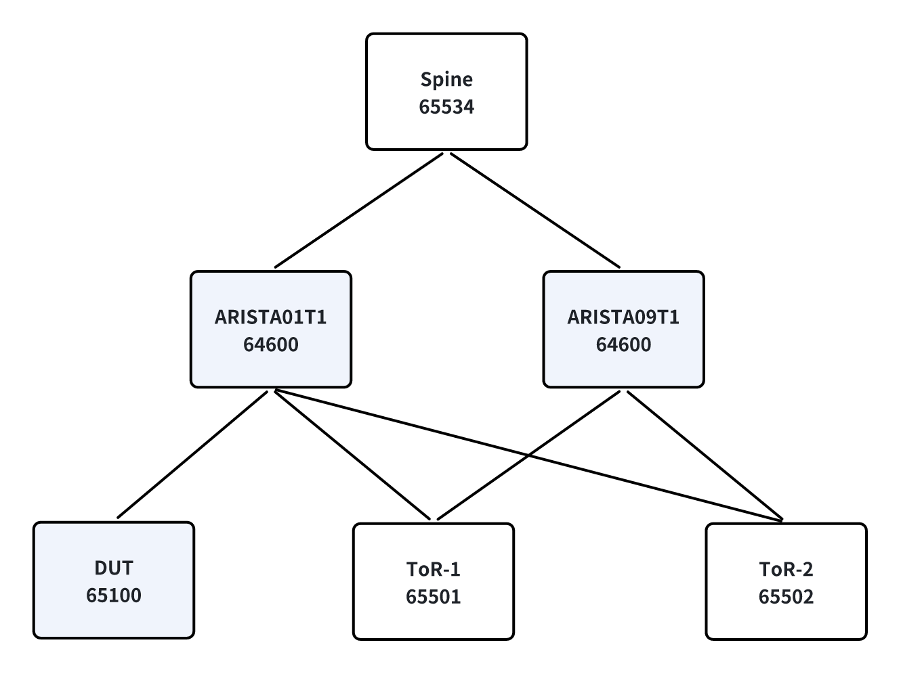
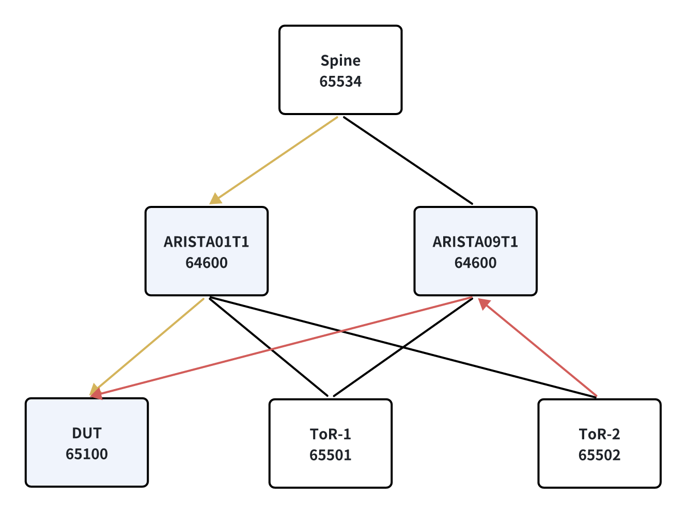
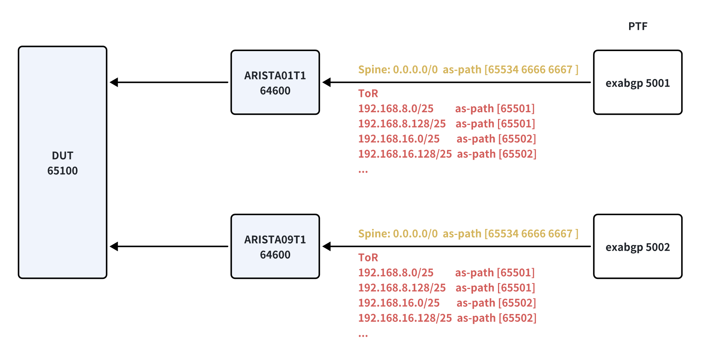

# 1. Network Topology


For t0 topo
- DUT as **ToR** router (dut_type: ToRRouter)
  ```
  configuration_properties:
    common:
      dut_asn: 65100
      dut_type: ToRRouter  <<<
  ```
- Arista VM container as **Leaf** router
  ```
  configuration:
    ARISTA01T1:
      properties:
      - common
      - leaf   <<<
  ```


# 2. BGP Neighbor
DUT and Arista VM establish **EBGP** neighbor
```
admin@r-bison-16:~$ show ip bgp summary 

IPv4 Unicast Summary:
BGP router identifier 10.1.0.32, local AS number 65100 vrf-id 0
BGP table version 12838
RIB entries 12867, using 1646976 bytes of memory
Peers 34, using 818448 KiB of memory
Peer groups 4, using 256 bytes of memory


Neighbhor      V     AS    MsgRcvd    MsgSent    TblVer    InQ    OutQ  Up/Down      State/PfxRcd  NeighborName
-----------  ---  -----  ---------  ---------  --------  -----  ------  ---------  --------------  --------------
10.0.0.129     4  64600       3237       3240     12838      0       0  00:01:37             6400  ARISTA01T1
10.0.0.145     4  64600       3237       3240     12838      0       0  00:01:37             6400  ARISTA09T1
10.0.0.161     4  64600       3235       3238     12838      0       0  00:01:33             6400  ARISTA17T1
10.0.0.177     4  64600       3235       3238     12838      0       0  00:01:32             6400  ARISTA25T1
10.0.0.193     4  64600       3235       3238     12838      0       0  00:01:33             6400  ARISTA33T1
10.0.0.209     4  64600       3235       3238     12838      0       0  00:01:33             6400  ARISTA41T1
```


# 3. BGP routes on DUT

- From upstream (yellow line):  Spine -> Leaf -> DUT
- From other ToR (red line):  ToR -> Leaf -> DUT




# 4. Generate routes
File: `ansible/library/announce_routes.py::generate_routes()`

## 4.1 Generate route for upstream
- IPv4: `0.0.0.0/0`
- IPv6: `::/0`

AS_PATH: Leaf + Spine + hard code value (6666 6667)
```
admin@r-bison-01:~$ vtysh -c "show bgp ipv4 0.0.0.0/0"
BGP routing table entry for 0.0.0.0/0, version 146
Paths: (32 available, best #1, table default)
  Advertised to non peer-group peers:
  10.0.0.129 10.0.0.145 10.0.0.161 10.0.0.177 10.0.0.193 10.0.0.209 10.0.0.225 10.0.0.241 10.0.1.1 10.0.1.17 10.0.1.33 10.0.1.49 10.0.1.65 10.0.1.81 10.0.1.97 10.0.1.113 10.0.2.129 10.0.2.145 10.0.2.161 10.0.2.177 10.0.2.193 10.0.2.209 10.0.2.225 10.0.2.241 10.0.3.1 10.0.3.17 10.0.3.33 10.0.3.49 10.0.3.65 10.0.3.81 10.0.3.97 10.0.3.113 10.0.4.1 10.0.4.3
  64600 65534 6666 6667
    10.0.2.145 from 10.0.2.145 (100.1.1.73)
      Origin IGP, valid, external, multipath, best (Older Path)
      Community: 5060:12345
      Last update: Fri Dec  5 04:06:46 2025
  64600 65534 6666 6667
    10.0.0.129 from 10.0.0.129 (100.1.0.65)
      Origin IGP, valid, external, multipath
      Community: 5060:12345
      Last update: Fri Dec  5 04:07:40 2025
```


## 4.2 Generate routes for ToR
Example: topo_t0-isolated-d32u32s2.yml
```
configuration_properties:
  common:
    dut_asn: 65100
    dut_type: ToRRouter
    nhipv4: 10.10.246.254
    nhipv6: FC0A::FF
    podset_number: 200
    tor_number: 16
    tor_subnet_number: 2
    max_tor_subnet_number: 16
    tor_subnet_size: 128
    spine_asn: 65534
    leaf_asn_start: 64600
    tor_asn_start: 65500
    failure_rate: 0
```
- Routes number
```
number = podset_number * tor_number * tor_subnet_number
       = 200 * 16 * 2
       = 6400
```


- Routes prefix
```
suffix = ((podset * tor_number * max_tor_subnet_number * tor_subnet_size) +
          (tor * max_tor_subnet_number * tor_subnet_size) +
          (subnet * tor_subnet_size) + offset)

octet2 = (168 + int(suffix / (256 ** 2)))
octet1 = (192 + int(octet2 / 256))
octet2 = (octet2 % 256)
octet3 = (int(suffix / 256) % 256)
octet4 = (suffix % 256)
prefixlen_v4 = (32 - int(math.log(tor_subnet_size, 2)))

prefix = "{}.{}.{}.{}/{}".format(octet1, octet2, octet3, octet4, prefixlen_v4)
```

Example: `podset=0, tor=1, subnet=0` -> `192.168.8.0/25`
```
suffix = (0 * 16 * 16 * 128) + (1 * 16 * 128) + (0 * 128) + 0 = 2048
       = 0 + 2048 + 0 + 0
       = 2048

# Step 1: octet2
octet2 = 168 + int(suffix / (256 ** 2))
       = 168 + int(2048 / 65536)
       = 168

# Step 2: octet1
octet1 = 192 + int(octet2 / 256)
       = 192 + int(168 / 256)
       = 192

# Step 3: octet2
octet2 = octet2 % 256
       = 168 % 256
       = 168

# Step 4: octet3
octet3 = int(suffix / 256) % 256
       = int(2048 / 256) % 256
       = 8 % 256
       = 8

# Step 5: octet4
octet4 = suffix % 256
       = 2048 % 256
       = 0

# Result
prefix: "{}.{}.{}.{}/25".format(192, 168, 8, 0) = "192.168.8.0/25"
tor_asn = 65500 + 1 = 65501
aspath: "65501"
```

Example: `podset=0, tor=1, subnet=1` -> `192.168.8.128/25`
```
suffix = (0 * 16 * 16 * 128) + (1 * 16 * 128) + (1 * 128) + 0 = 2048
       = 0 + 2048 + 128 + 0
       = 2176

# Step 1: octet2
octet2 = 168 + int(suffix / (256 ** 2))
       = 168 + int(2176 / 65536)
       = 168

# Step 2: octet1
octet1 = 192 + int(octet2 / 256)
       = 192 + int(168 / 256)
       = 192

# Step 3: octet2
octet2 = octet2 % 256
       = 168 % 256
       = 168

# Step 4: octet3
octet3 = int(suffix / 256) % 256
       = int(2176 / 256) % 256
       = 8 % 256
       = 8

# Step 5: octet4
octet4 = suffix % 256
       = 2176 % 256
       = 128

# Result
prefix: "{}.{}.{}.{}/25".format(192, 168, 8, 0) = "192.168.8.128/25"
tor_asn = 65500 + 1 = 65501
aspath: "65501"
```


# Announce route
- Announce route: `curl -X POST http://localhost:5001 -d "commands=announce route 123.123.123.0/24 next-hop 10.10.246.254 as-path [ 12345 ]"`
- Withdraw route: `curl -X POST http://localhost:5001 -d "commands=withdraw route 123.123.123.0/24 next-hop 10.10.246.254 as-path [ 12345 ]"`

