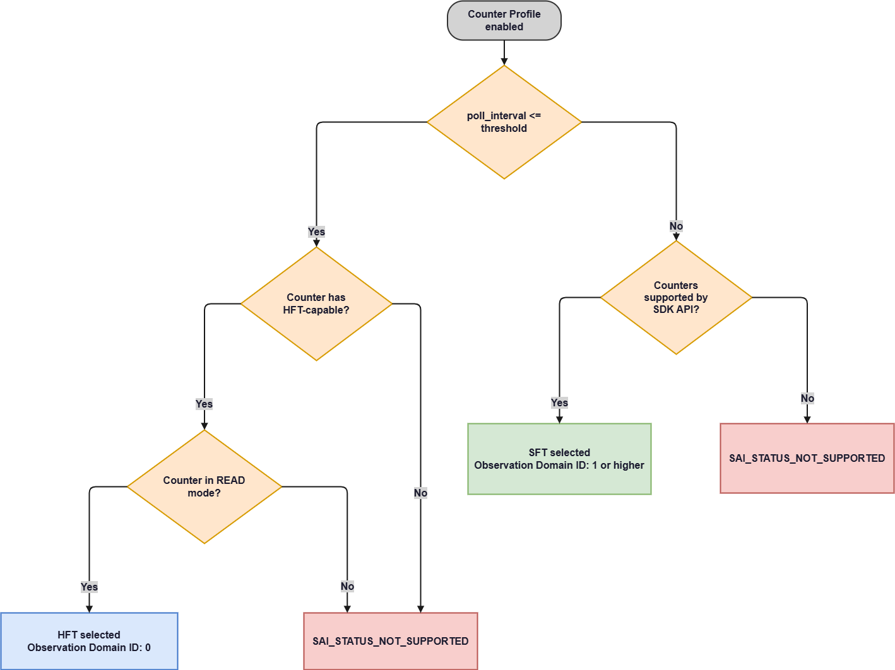

# Unified HFT/SFT Streaming Test Plan

---

## Background

SONiC currently collects counters through **High Frequency Telemetry (HFT)**: the ASIC reads
native counters over a dedicated DMA channel and the kernel emits IPFIX records to the
`sonic_stel` Generic Netlink family, which `countersyncd` consumes. That path is fast and
cheap, but it cannot handle counters that need software processing - aggregation across
several hardware counters, cell-to-byte conversion, `READ_AND_CLEAR`, or long polling
intervals.

**Slow Frequency Telemetry (SFT)** adds a second producer inside NVIDIA SAI. A SAI-owned
worker polls counters through the SDK bulk-counter API, performs the required aggregation
and read-clear operations, builds IPFIX records, and publishes them to **the same**
`sonic_stel` family and `ipfix` multicast group. `countersyncd` receives both producers
from one subscription.

The user-facing model does not change. The same `config hft` commands, the same
`HIGH_FREQUENCY_TELEMETRY_PROFILE` / `HIGH_FREQUENCY_TELEMETRY_GROUP` tables, and the same
YANG model configure both producers. **NVIDIA SAI alone decides which path handles a
session**, and the decision is transparent to SONiC.

### Path selection

SAI classifies each telemetry type from three inputs: the configured `poll_interval`,
whether every counter is HFT-capable, and the stats mode of every subscription.



**HFT is selected only when all three conditions hold at the same time:**
- the `poll_interval` is at or below the HFT/SFT threshold,
- every counter in the telemetry type is HFT-capable
- every subscription uses `READ` mode.

If the interval is low enough but either of the other two conditions is not met, the
session returns `SAI_STATUS_NOT_SUPPORTED`. It does not fall back to SFT. Classification
applies to the whole telemetry type - a single subscription that breaks any condition
rejects the entire group.

### Counters configured as `READ_AND_CLEAR`

`READ` returns the counter value and leaves it untouched, while `READ_AND_CLEAR` returns
the value and then resets the counter to zero, so each sample covers only the time since
the previous read. Everything not listed here is `READ`.

| Object type | Counter |
|---|---|
| `INGRESS_PRIORITY_GROUP` | `WATERMARK_BYTES` |
| `INGRESS_PRIORITY_GROUP` | `SHARED_WATERMARK_BYTES` |
| `INGRESS_PRIORITY_GROUP` | `XOFF_ROOM_WATERMARK_BYTES` |
| `BUFFER_POOL` | `WATERMARK_BYTES` |
| `BUFFER_POOL` | `XOFF_ROOM_WATERMARK_BYTES` |

### Configuration examples

```bash
# HFT selected - 1 ms interval, native READ counters
config hft add profile fast-port --poll_interval 1000 --stream_state disabled
config hft add group fast-port --group_type PORT \
    --object_names Ethernet0,Ethernet8 \
    --object_counters IF_IN_OCTETS,IF_OUT_OCTETS
config hft enable fast-port

# SFT selected - 1000 ms interval, READ_AND_CLEAR watermark
config hft add profile pg-watermark --poll_interval 1000000 --stream_state disabled
config hft add group pg-watermark --group_type INGRESS_PRIORITY_GROUP \
    --object_names 'Ethernet0|3,Ethernet0|4' \
    --object_counters WATERMARK_BYTES
config hft enable pg-watermark
```

---

## Test Cases

All cases run on the `any` topology against SPC5/SPC6 platforms and live in
`tests/high_frequency_telemetry/test_hft_sft_streaming.py` unless stated otherwise.
Records are validated through the existing OTel collector to InfluxDB pipeline using the
`InfluxDbSink` helper. Cases that need to tell which path was used read the Observation
Domain ID; cases that need to check the stats mode read
`SAI_TAM_COUNTER_SUBSCRIPTION_ATTR_STATS_MODE` from ASIC_DB.

---

### Test Case #1: test_sft_streaming

**Objective**: Verify that a profile with a long polling interval collects every counter
the platform supports for one object type, and that the values arrive in InfluxDB.
Parametrized over `PORT`, `QUEUE`, `INGRESS_PRIORITY_GROUP`, and `BUFFER_POOL`.

**Test Steps**:
1. **Configure** - create a profile with `poll_interval` 100 ms and one group of the
   parametrized object type, with every supported counter on every configured object.
2. **Enable** - set `stream_state` to `enabled` and check the command succeeds.
3. **Collect** - wait until InfluxDB has at least 20 points for every configured object
   and counter.
4. **Check the data** - every configured object and counter is present, nothing extra
   shows up, the time between points is 100 ms within tolerance, and every value is
   valid and tagged with the object it was configured for.
5. **Cleanup** - delete the group and the profile.

---

### Test Case #2: test_same_counter_work_on_hft_and_sft_flow

**Objective**: Verify that the same objects and counters are served by HFT when the
polling interval is short and by SFT when it is long. Nothing in the user configuration
says which path to use; only the interval changes.

**Test Steps**:
1. **Configure HFT interval** - create a `PORT` group with native `READ` counters at
   `poll_interval` 1 ms. Enable it.
2. **Assert HFT path** - records arrive and carry Observation Domain ID `0`.
3. **Delete** - remove the profile.
4. **Configure SFT interval** - recreate the same objects and counters at
   `poll_interval` 1000 ms. Enable it.
5. **Assert SFT path** - records arrive and carry a non-zero Observation Domain ID.
6. **Assert values** - the received values agree with the same counters read from
   COUNTERS_DB.
7. **Cleanup** - delete the group and the profile.

---

### Test Case #3: test_read_and_clear_behavior

**Objective**: Verify that watermark counters are read with `READ_AND_CLEAR`, that
clearing makes their values behave differently from ordinary `READ` counters, and that two
profiles cannot read and clear the same counter at the same time.

**Test Steps**:
1. **Configure** - create an `INGRESS_PRIORITY_GROUP` profile at `poll_interval` 1000 ms
   including tow counters:
   -  `WATERMARK_BYTES`: `READ_AND_CLEAR` mode
   -  `WATERMARK_CELLS`. `READ` mode
2. **Check the stats mode** - read `SAI_TAM_COUNTER_SUBSCRIPTION_ATTR_STATS_MODE` from
   ASIC_DB; `WATERMARK_BYTES` is `READ_AND_CLEAR` and `WATERMARK_CELLS` is `READ`.
3. **Send traffic** - send traffic that raises buffer occupancy, then stop it.
4. **Check the two series differ** - the `WATERMARK_BYTES` values rise and fall, while the
   `WATERMARK_CELLS` values never decrease.
   - `WATERMARK_BYTES` (`READ_AND_CLEAR`): 100 → 800 → 300 → 200
   - `WATERMARK_CELLS` (`READ`): 100 → 800 → 800 → 800
5. **Add a duplicate READ_AND_CLEAR** - create a second profile with the same PG objects
   and `WATERMARK_BYTES`, enable it, and check it is rejected while the first profile
   keeps collecting. Two `READ_AND_CLEAR` subscriptions on the same object and counter
   cannot work: whichever one reads first clears the hardware counter, so the other
   silently gets a near-zero value instead of an error.
6. **Add a duplicate READ** - create a third profile with the same PG objects and
   `CURR_OCCUPANCY_CELLS`, enable it, and check it collects normally. `READ` does not
   change the counter, so any number of subscriptions can read the same value without
   affecting each other.
7. **Cleanup** - delete all profiles.

---

### Test Case #4: test_hft_sft_run_at_same_time

**Objective**: Verify that an HFT profile and an SFT profile can run at the same time
without disturbing each other, and that stopping one leaves the other running.

**Test Steps**:
1. **Configure HFT profile** - create a `PORT` profile at `poll_interval` 1 ms with
   native `READ` counters.
2. **Configure SFT profile** - create a `QUEUE` profile at `poll_interval` 1000 ms
   with its supported counters.
3. **Enable** - enable both profiles.
4. **Assert both collect** - both sets of series receive points at their configured
   interval and carry the expected Observation Domain ID.
5. **Disable HFT** - set the HFT profile `stream_state` to `disabled`.
6. **Assert SFT unaffected** - the HFT series stop and the SFT series keep receiving
   points at their original interval.
7. **Re-enable HFT and disable SFT** - assert the HFT series resume.
8.  **Assert HFT unaffected** - the SFT series stop and the HFT series keep receiving
    points at their original interval.
9.  **Cleanup** - delete both profiles.

---

### Test Case #5: test_multi_sft_independent

**Objective**: Verify that several SFT profiles can run at once, each keeping its own
polling interval, and that stopping or restarting one does not disturb the others.

**Test Steps**:
1. **Configure three profiles** - create a `PORT` profile at `poll_interval` 100 ms, a
   `QUEUE` profile at 1000 ms, and an `INGRESS_PRIORITY_GROUP` profile at 5000 ms.
2. **Enable** - enable all three.
3. **Assert independent intervals** - each profile's series receive points at its own
   configured interval.
4. **Assert domain uniqueness** - each profile holds a different non-zero Observation
   Domain ID.
5. **Assert template uniqueness** - all active Template IDs across the three sessions are
   unique.
6. **Disable the QUEUE profile** - set its `stream_state` to `disabled`.
7. **Assert the others are unaffected** - its series stop while the other two keep
   receiving points at their original interval.
8. **Re-enable** - enable the `QUEUE` profile again.
9. **Assert recovery** - its series resume and it holds a valid non-zero domain.
10. **Cleanup** - delete all three profiles.

---

### Test Case #6: test_hft_with_multiple_sft

**Objective**: Verify that one HFT profile and several SFT profiles all run at the same
time, each keeping its own polling interval. This is the shape a real deployment is
expected to use.

**Test Steps**:
1. **Configure HFT profile** - create a `PORT` profile at `poll_interval` 1 ms with native
   `READ` counters.
2. **Configure two SFT profiles** - create a `QUEUE` profile at `poll_interval` 100 ms and
   an `INGRESS_PRIORITY_GROUP` profile at `poll_interval` 1000 ms.
3. **Enable** - enable all three profiles.
4. **Assert all collect** - every profile's series receive points at its own configured
   interval.
5. **Assert domain IDs** - the HFT profile uses Observation Domain ID `0` and each SFT
   profile uses a different non-zero value.
6. **Assert template IDs** - all active Template IDs across the three profiles are unique.
7. **Assert no message loss** - for every profile, the number of points received matches
   the elapsed time divided by the configured interval.
8. **Cleanup** - delete all three profiles.

---

### Test Case #7: test_same_counter_on_both_paths_at_same_time

**Objective**: Verify that the same object and counter can be collected by an HFT profile
and an SFT profile that are both running at the same time. One counter can be served by
both paths at once, as long as it is read in `READ` mode.

**Test Steps**:
1. **Configure HFT profile** - create a `PORT` profile at `poll_interval` 1 ms carrying
   `IF_IN_OCTETS` on one port.
2. **Configure SFT profile** - create a second `PORT` profile at `poll_interval` 1000 ms
   carrying the same `IF_IN_OCTETS` on the same port.
3. **Enable** - enable both profiles.
4. **Assert both collect** - both profiles receive points at their own configured interval.
5. **Assert separate sessions** - the HFT profile uses Observation Domain ID `0`, the SFT
   profile uses a non-zero value, and the two profiles use different Template IDs.
6. **Assert values agree** - both series track the same counter, so their values stay close
   to each other and to the value read from COUNTERS_DB.
7. **Cleanup** - delete both profiles.

---

### Test Case #8: test_profile_lifecycle

**Objective**: Verify that a profile can be created, deleted, and created again, and that
its settings cannot be changed while it is still running. Parametrized over HFT
(`poll_interval` 1 ms) and SFT (`poll_interval` 1000 ms).

**Test Steps**:
1. **Configure** - create a `PORT` profile at the parametrized interval. Enable it.
2. **Assert collection** - points are received and the STATE_DB session entry exists.
3. **Change while running** - modify `poll_interval` with the profile still enabled.
4. **Assert change rejected** - the change is rejected and the running session keeps its
   original interval and templates.
5. **Delete** - remove the group and the profile.
6. **Assert stopped** - no new points arrive and the STATE_DB session entry is removed.
7. **Recreate** - create the same profile and group again. Enable it.
8. **Assert resumed** - points are received again.
9. **Cleanup** - delete the group and the profile.

---

### Test Case #9: test_invalid_config_rejected

**Objective**: Verify that bad configuration values are rejected with a clear error
message and that nothing is left behind in CONFIG_DB.

**Test Steps**:
1. **Run** - for each row in the table below, run the corresponding `config hft` command.
2. **Assert rejection** - the command returns a non-zero code and prints an error naming
   the invalid field.
3. **Assert no side effect** - CONFIG_DB holds no entry for the attempted profile or group,
   and no STATE_DB session is created.

| # | Invalid input | Example |
|---|---|---|
| 1 | Empty profile name | `config hft add profile ""` |
| 2 | Unknown group type | `--group_type FOO` |
| 3 | Non-existent object | `--object_names Ethernet9999` |
| 4 | Counter invalid for the object type | `PORT` group with `WATERMARK_BYTES` |
| 5 | Zero polling interval | `--poll_interval 0` |
| 6 | Polling interval below the counter minimum | `--poll_interval 1` |
| 7 | Invalid stream state | `--stream_state on` |

---

## Refer

The following design documents are referenced by this test plan:

- Existing HFT test plan: [HFT-test-plan.md](HFT-test-plan.md)
- SONiC HFT HLD: https://github.com/sonic-net/SONiC/blob/master/doc/high-frequency-telemetry/high-frequency-telemetry-hld.md
