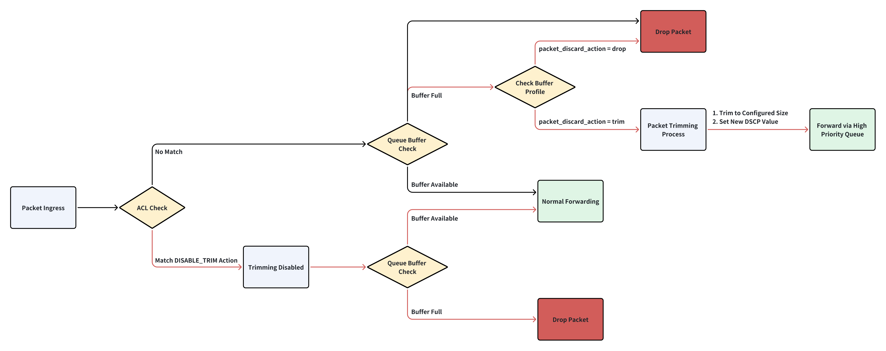

# 1. Feature Overview
In traditional packet loss handling, when a lossy queue exceeds its buffer threshold, packets are silently dropped without notifying the destination host. While packet recovery can occur via fast retransmission or timeout-based retransmission, the latter method introduces significant latency, degrading application performance.

Packet Trimming is an enhancement mechanism designed to optimize network performance during congestion conditions. It will trim packet to a configured size, and try sending it on a different queue to deliver a packet drop notification to an end host. This speeds up retransmissions and reduces network latency.


# 2. Packet Flow


**Notes**:
- Black line: Packet processing flow **without** the trimming function
- Red line: Packet processing flow **with** the trimming function

**Packet Flow**:
1. When a packet enters the switch, the switch will check the packet according to the configured ACL rules.
   - If packet does not match ACL rule with the `DISABLE_TRIM` action, it will enter its assigned queue.
   - If packet match an ACL rule with the `DISABLE_TRIM` action, it will not be trimmed even if the buffer is full. Even if the Buffer Profile of the queue is configured with `packet_discard_action = "trim"`, the packet will be discarded without trimming.

2. If the packet does not match any ACL rule, the packet enters the specified queue and checks whether the queue buffer has enough space.
   - If the buffer has space -> forward normally
   - If the buffer is full -> proceed to the next step

3. Check the `packet_discard_action` parameter of the Buffer Profile configuration for the queue application:
   - If set to `drop` -> directly discard the entire packet
   - ​​If set to `trim` -> enter the trimming process

4. Trimming of packets
   - Trimming packets to the configured size
   - Setting new DSCP values
   - Sending trimmed packets to the specified queue


# 3. Limitation
1. Packet trimming ​only supports IPv4 and IPv6 unicast packets. The ARP/NDP/ECMP are ​not supported. Any encap/decap packets (e.g., VxLAN, GRE, MPLS) are ​not supported.
2. Packet trimming only supports "Lossy Queue" and it is configured only on the egress queue.
3. Packet trimming only supports config reload and cold reboot, does not support warm/fast reboot.
4. After packet is trimmed, the `checksum` and `IP length` fields in IP header is not recalculated.
5. Trimmed packet counters for PORT/QUEUE levels are not supported.


# 4. Related Command
1. Trimming global config.
   - config: `config switch-trimming global --size 256 --dscp 48 --queue 6`  
   - show: `show switch-trimming global`
    ```json
    {
        "SWITCH_TRIMMING": {
            "GLOBAL": {
                "size": "256",
                "dscp_value": "48",
                "queue_index": "6"
            }
        }
    }
    ```

2. Buffer related config.
    ```json
    {
        "BUFFER_POOL": {
            "egress_lossy_pool": {
                "mode": "dynamic",
                "type": "egress"
            }
        },
        "BUFFER_PROFILE": {
            "q_lossy_trim_profile": {
                "dynamic_th": "3",
                "pool": "egress_lossy_pool",
                "size": "0",
                "packet_discard_action": "trim"
            }
        },
        "BUFFER_QUEUE": {
            "Ethernet0|3": {
                "profile": "q_lossy_trim_profile"
            }
        }
    }
    ```

3. ACL related config.
    ```json
    {
        "ACL_TABLE_TYPE": {
            "TRIMMING_L3": {
                "MATCHES": [
                    "SRC_IP"
                ],
                "ACTIONS": [
                    "DISABLE_TRIM_ACTION"
                ],
                "BIND_POINTS": [
                    "PORT"
                ]
            }
        },
        "ACL_TABLE": {
            "TRIM_TABLE": {
                "POLICY_DESC": "Packet trimming",
                "TYPE": "TRIMMING_L3",
                "STAGE": "INGRESS",
                "PORTS": [
                    "Ethernet0"
                ]
            }
        },
        "ACL_RULE": {
            "TRIM_TABLE|TRIM_RULE": {
                "PRIORITY": "999",
                "SRC_IP": "1.1.1.1/32",
                "PACKET_ACTION": "DISABLE_TRIM"
            }
        }
    }
    ```


# 5. Test Cases
## Test Case 1: Verify Trimming Configuration via CLI command / Config DB
**Objective**: Validate trimming configuration through CLI commands / Config DB.  
**Test Steps**
1. Configure trimming via CLI `config switch-trimming global --size 256 --dscp 48 --queue 6`.
2. Verify the config in running config by CLI `show switch-trimming global`.
    ```json
    {
        "SWITCH_TRIMMING": {
            "GLOBAL": {
                "size": "256",
                "dscp_value": "48",
                "queue_index": "6"
            }
        }
    }
    ```
3. Verify the config in config DB.
   ```
   redis-cli -n 4 HGETALL 'SWITCH_TRIMMING|GLOBAL'
   1) "size"
   2) "256"
   3) "dscp_value"
   4) "48"
   5) "queue_index"
   6) "6"
   ```
4. Configure trimming via config_db.
5. Verify the trimming config by CLI and config DB command.
6. Verify the boundary values ​​of the trimming configuration and verfiy syslog record correct messages.
   - `size`: the supported minimum size value is 256
   - `dscp_value`: 0-63
   - `queue_index`: 0-7
7. Config invalid value, verify syslog records error messages.

---

## Test Case 2: Verify Packet Size After Trimming
**Objective**: Ensure trimmed packets retain headers and meet size requirements.  
**Test Steps**
1. Configure packet trimming in global level and set `"size": "256"`.
2. Create a buffer profile setting `packet_discard_action=trim` and apply buffer profile.
3. Send 1500B packets from PTF to DUT to trigger trimming.
4. Capture egress packets and verify trimmed packet size is 256B, verify the TTL value is correct in the trimmed packet.
5. Update the trimming size value to 9000.
6. Send 9100B packets from PTF to DUT to test jumb packet trimming. 
7. Capture egress packets and verify trimmed packet size is 9000B.

---

## Test Case 3: Verify DSCP Remapping After Trimming  
**Objective**: Validate DSCP value is updated after trimming.  
**Test Steps**:  
1. Configure packet trimming in global level and set `"dscp_value": "48"`, `"size": "256"`.
2. Send 1500B packets with DSCP=0.
3. Capture egress packets and verify the DSCP value has updated to 48.
4. Send 100B packets (less than 256) with DSCP=0.
5. Capture egress packets and verify that the packets are not trimmed but the DSCP value is updated to 48.

---

## Test Case 4: Verify Trimming with Static/Dynamic Buffer Model
**Objective**: Validate trimming behavior under static and dynamic buffer allocation.  
**Test Steps**:  
1. Configure packet trimming in global level.
2. Config `mode: dynamic` in `BUFFER_POOL`.
3. Send packets from PTF to DUT to trigger trimming. 
4. Capture egress packets and verfiy trimming works for dynamic buffer model.
5. Update the `mode: static` for `BUFFER_POOL`.
6. Repeat step3-4 to verfiy trimming works for static buffer model.

---

## Test Case 5: Verify Trimming on Physical/LAG Ports  
**Objective**: Validate trimming on physical ports and LAG members.  
**Test Steps**:  
1. Configure packet trimming in global level and bind buffer profile to `Ethernet0`.
2. Send packets from PTF to DUT `Ethernet0` to trigger trimming.
3. Capture egress packets and verify the trimming works well on `Ethernet0`.
4. Create `PortChannel1` and add member `Ethernet0`.
5. Send packets to `PortChannel1` and verfiy trimming still works for `Ethernet0`.

---

## Test Case 6: Verify Trimming Compatibility with Lossless Queues
**Objective**: Validate trimmed packets can be sent from a lossless queue.  
**Test Steps**:  
1. Configure Ethernet0 queue4 as a ​lossless queue.
2. Enable packet trimming globally and set "queue_index": "4" under SWITCH_TRIMMING.
3. Send packets from PTF to DUT Ethernet0 to trigger trimming.
4. Capture egress packets on queue4 and verify trimmed packets are successfully transmitted through the lossless queue.

---

## Test Case 7: Verify ACL Disable Trimming Action
**Objective**: Verify trimming does not work if ACL rule with the `DISABLE_TRIM` action is matched.  
**Test Steps**:
1. Configure packet trimming in global level and set `packet_discard_action=trim` in buffer profile.
2. Create ACL rules to disable trimming action for specific flows.
   ```json
    "ACL_RULE": {
        "TRIM_TABLE|TRIM_RULE": {
            "PRIORITY": "999",
            "SRC_IP": "1.1.1.1/32",
            "PACKET_ACTION": "DISABLE_TRIM"
        }
    }
   ```
3. Send packets with src_ip `1.1.1.1` (matched ACL rule) to DUT and exceeding buffer threshold.
4. Verify the packets are dropped (not trimmed).
5. Verify ACL disable trim action counter increments.
6. Send packets with src_ip `1.1.1.2` (not matched ACL rule) to DUT and exceeding buffer threshold.
7. Verfiy the packet is trimmed.

---

## Test Case 8: Configuration Persistence After Reload/Reboot
**Objective**: Validate trimming config survives after cold reboot/config reload.  
**Test Steps**:  
1. Configure packet trimming in global level and bind buffer profile.
2. Send packets and verify trimming function works well.
3. DUT config reload.
4. Verify trimming global config and queue bindings persist and trimming function still works well.
5. DUT cold reboot.
6. Verify trimming global config and queue bindings persist and trimming function still works well.

---

## Test Case 9: Verify Trimming During Multiple Egress Port Admin Toggle
**Objective**: Validate trimming functions when repeatedly enabling/disabling egress ports.  
**Test Steps**:
1. Configure packet trimming in global level and bind buffer profile on Ethernet0.
2. Send packets and verify trimming function works well on Ethernet0.
3. Toggle admin state 10 times on Ethernet0.
4. After each toggle, verify the buffer profile and buffer configuration are applied correctly on Ethernet0.
5. After each toggle, send traffic and verify trimming function works well on Ethernet0.

---

## Test Case 10: Stability During Feature State Toggles
**Objective**: Ensure no crashes occur during repeated trimming config changes.  
**Test Steps**:
1. Configure packet trimming in global level and bind buffer profile.
2. Send packets and verify trimming function works well.
3. Update the `packet_discard_action` value (`trim` -> `drop` -> `trim`) in the buffer profile 10 times.
4. Verify trimming function works well consistently.
5. Verify no crashes/core dumps observed.

---

## Test Case 11: SRv6 Compatibility with Trimming
**Objective**: Validate SRv6 functions when trimming is enabled/disabled.  
**Test Steps**:  
1. Configure packet trimming in global level and bind buffer profile.
2. Config SRv6 as pipe mode.
3. Verify the trimming function works well for SRv6 SHIFT packet.
   - Verify the SRv6 SHIFT packet is trimmed, verify the trimmed packet size is correct.
   - Verify the DSCP value in outer header is updated and DSCP value in inner header is not updated.
   - Verify the `segment left` decreased in SRH header.
4. Verify the trimming function works well for SRv6 DECAP packet.
   - Verify the SRv6 DECAP packet is trimmed, verify the trimmed packet size is correct.
   - Verify SRv6 packet decapsulation success.
   - Verify the DSCP value is not updated in the packet.  
  (The DSCP value of the outer header of the SRv6 packet is updated by trimming, and the DSCP value of the inner header is not updated. After decapsulation, the outer header is discarded, leaving only the inner packet. Therefore, the DSCP value of the inner header is not updated.)
