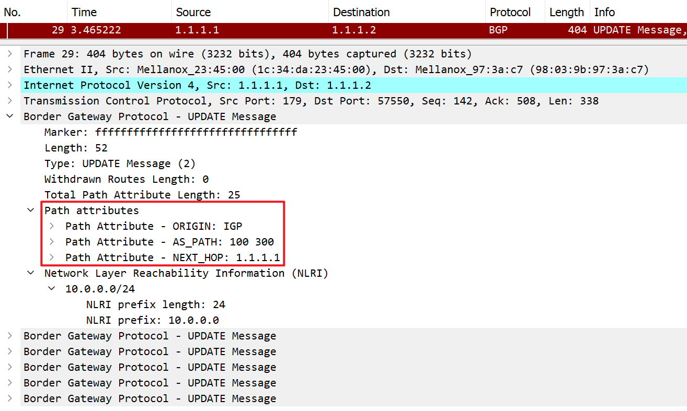
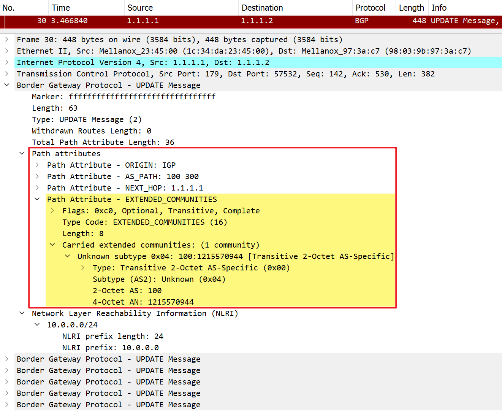
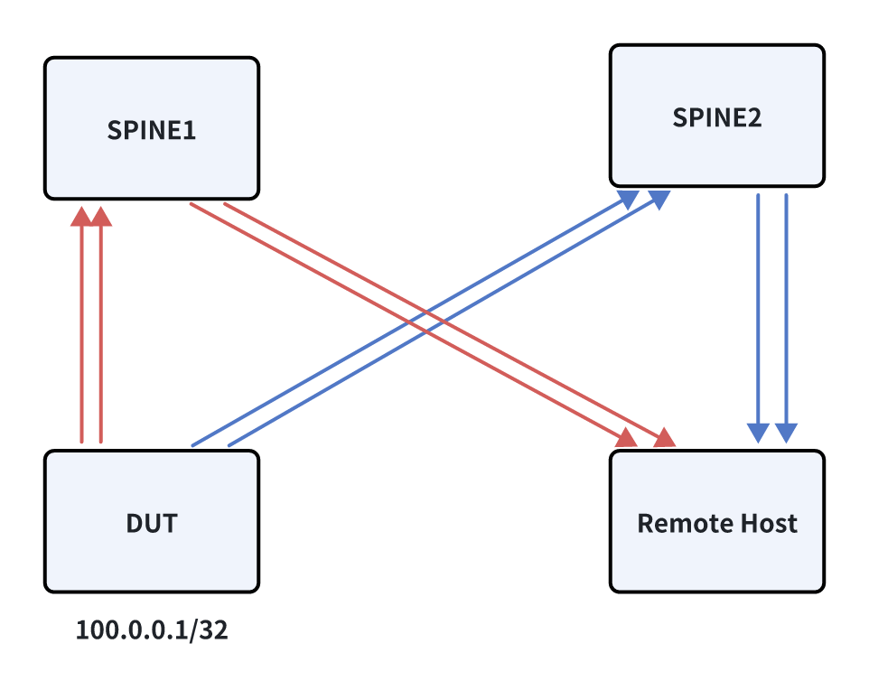

# WCMP Test Plan

## Related documents

| **Document Name** | **Link** |
|-------------------|----------|
| SONiC Weighted ECMP | [https://github.com/nazariig/SONiC/blob/773aacaeb7a6e5507af667898957b2060a78280e/doc/wcmp/wcmp-design.md]|

## Overview
In ECMP (Equal-Cost Multi-Path) scenario, traffic is distributed equally across all available paths and each path has same cost.

In WCMP (Weighted-Cost Multi-Path) scenario, it can distribute traffic base on the weight value assigned to each path. This is useful when the paths have different bandwidth capacities. In a WCMP setup, each path is assigned a weight based on various criteria, such as bandwidth, delay, or administrative preferences. BGP then uses these weights to distribute outbound traffic among the multiple available paths


## BGP link bandwidth extended community
The BGP link bandwidth extended community contains information about the bandwidth of a link. This information is advertised along with BGP route updates to inform other routers about the capacity of the link.
RFC: [https://datatracker.ietf.org/doc/html/draft-ietf-idr-link-bandwidth]

```
router bgp 65200
 bgp router-id 10.1.0.2
 no bgp ebgp-requires-policy
 neighbor SPINE1 peer-group
 neighbor SPINE1 remote-as 65100
 neighbor 10.10.1.1 peer-group SPINE1
 neighbor 10.10.2.1 peer-group SPINE1
 !
 address-family ipv4 unicast
  network 20.20.20.0/24
  neighbor SPINE1 route-map TO_BGP_PEER_V4 out      <<<<<<
 exit-address-family
exit
!
route-map TO_BGP_PEER_V4 permit 100
 set extcommunity bandwidth num-multipaths          <<<<<<
exit
!
route-map TO_BGP_PEER_V6 permit 100
 set extcommunity bandwidth num-multipaths
exit
```

### Disable WCMP
If WCMP is `disabled`, the BGP update message contains three default path attributes `ORIGIN`/`AS_PATH`/`NEXT_HOP` when advertising network prefix 10.0.0.0/24



### Enable WCMP
If WCMP is `enabled`, the BGP `EXTENDED_COMMUNITIES` attribute is added in the update message (yellow part)



## Related DUT CLI commands

### Config
The following command can be used to enable/disable WCMP:
```
config bgp device-global wcmp enabled
config bgp device-global wcmp disabled
```

### Show
The following command can be used to show WCMP status:
```
show bgp device-global
show bgp device-global --json
```
Example:
```
admin@r-ocelot-07:~$ show bgp device-global
TSA       WCMP
--------  -------
disabled  enabled
```
```
admin@r-ocelot-07:~$ show bgp device-global --json
{
    "tsa": "disabled",
    "wcmp": "enabled"
}
```


## Related DUT configuration files
```
"BGP_DEVICE_GLOBAL": {
    "STATE": {
        "tsa_enabled": "false",
        "wcmp_enabled": "true"
    }
}
```


## Test structure
DUT advertises BGP route prefix to SPINE1 (red line) and SPINE2 (blue line), then SPINE1 and SPINE2 forward the route to Remote host. So there are 4 nexthops to the DUT on the remote host routing table.



- If WCMP is `disabled`, the weight value of route on remote host is 1
```
admin@mtvr-moose-02:~$ ip route show 100.0.0.1
100.0.0.1 proto bgp metric 20
        nexthop via 10.10.26.1 dev Ethernet100 weight 1
        nexthop via 10.10.27.1 dev Ethernet104 weight 1
        nexthop via 10.10.28.1 dev Ethernet108 weight 1
        nexthop via 10.10.29.1 dev Ethernet112 weight 1
```

- If WCMP is `enabled`, the weight value of route on remote host is 25
```
admin@mtvr-moose-02:~$ ip route show 100.0.0.1
100.0.0.1 proto bgp metric 20
        nexthop via 10.10.26.1 dev Ethernet100 weight 25
        nexthop via 10.10.27.1 dev Ethernet104 weight 25
        nexthop via 10.10.28.1 dev Ethernet108 weight 25
        nexthop via 10.10.29.1 dev Ethernet112 weight 25
```

## Test cases
### Test case #1 - WCMP command line test
1. Enable WCMP and verify WCMP status
```
admin@mtvr-moose-02:~$ sudo config bgp device-global wcmp enabled
admin@mtvr-moose-02:~$ show bgp device-global
TSA       WCMP
--------  -------
disabled  enabled
```
2. Verify BGP link bandwidth extended community is added in FRR
```
mtvr-moose-02# show running-config bgp
Building configuration...

Current configuration:
!
route-map TO_BGP_PEER_V4 permit 100
 set extcommunity bandwidth num-multipaths
exit
!
route-map TO_BGP_PEER_V6 permit 100
 set extcommunity bandwidth num-multipaths
exit
!
end
```
3. Verify the route weight value on remote host is 25, which means WCMP is effect
```
admin@mtvr-moose-02:~$ ip route show 100.0.0.1
100.0.0.1 proto bgp metric 20
        nexthop via 10.10.26.1 dev Ethernet100 weight 25
        nexthop via 10.10.27.1 dev Ethernet104 weight 25
        nexthop via 10.10.28.1 dev Ethernet108 weight 25
        nexthop via 10.10.29.1 dev Ethernet112 weight 25
```
4. Disable WCMP and verify WCMP status
```
admin@mtvr-moose-02:~$ sudo config bgp device-global wcmp disabled
admin@mtvr-moose-02:~$ show bgp device-global
TSA       WCMP
--------  -------
disabled  disabled
```
5. Verify BGP link bandwidth extended community is deleted in FRR
```
mtvr-moose-02# show running-config bgp
Building configuration...

Current configuration:
!
route-map TO_BGP_PEER_V4 permit 100
exit
!
route-map TO_BGP_PEER_V6 permit 100
exit
!
end
```
6. Verify the route weight value on remote host is 1, which means WCMP is disabled
```
admin@mtvr-moose-02:~$ ip route show 100.0.0.1
100.0.0.1 proto bgp metric 20
        nexthop via 10.10.26.1 dev Ethernet100 weight 1
        nexthop via 10.10.27.1 dev Ethernet104 weight 1
        nexthop via 10.10.28.1 dev Ethernet108 weight 1
        nexthop via 10.10.29.1 dev Ethernet112 weight 1
```
7. Config WCMP with invalid parameter, verify config fail and report error message
```
admin@mtvr-moose-02:~$ sudo config bgp device-global wcmp 1
Usage: config bgp device-global wcmp [OPTIONS] COMMAND [ARGS]...
Try "config bgp device-global wcmp -h" for help.

Error: No such command "1".
```

### Test case #2 - Config WCMP from config_db.json file
1. Use redis-cli to enable WCMP in the database directly
```
root@mtvr-moose-02:/home/admin# redis-cli -n 4 HSET "BGP_DEVICE_GLOBAL|STATE" "wcmp_enabled" "true"
(integer) 0
root@mtvr-moose-02:/home/admin# redis-cli -n 4 HGETALL "BGP_DEVICE_GLOBAL|STATE"
1) "tsa_enabled"
2) "false"
3) "wcmp_enabled"
4) "true"
```
2. Verify BGP link bandwidth extended community is added in FRR
```
mtvr-moose-02# show running-config bgp
Building configuration...

Current configuration:
!
route-map TO_BGP_PEER_V4 permit 100
 set extcommunity bandwidth num-multipaths
exit
!
route-map TO_BGP_PEER_V6 permit 100
 set extcommunity bandwidth num-multipaths
exit
!
end
```
3. Verify the route weight value on remote host is 25, which means WCMP is effect
```
admin@mtvr-moose-02:~$ ip route show 100.0.0.1
100.0.0.1 proto bgp metric 20
        nexthop via 10.10.26.1 dev Ethernet100 weight 25
        nexthop via 10.10.27.1 dev Ethernet104 weight 25
        nexthop via 10.10.28.1 dev Ethernet108 weight 25
        nexthop via 10.10.29.1 dev Ethernet112 weight 25
```
4. Use redis-cli to disable WCMP in the database directly
```
root@mtvr-moose-02:/home/admin# redis-cli -n 4 HSET "BGP_DEVICE_GLOBAL|STATE" "wcmp_enabled" "false"
(integer) 0
root@mtvr-moose-02:/home/admin# redis-cli -n 4 HGETALL "BGP_DEVICE_GLOBAL|STATE"
1) "tsa_enabled"
2) "false"
3) "wcmp_enabled"
4) "false"
```
5. Verify BGP link bandwidth extended community is deleted in FRR
```
mtvr-moose-02# show running-config bgp
Building configuration...

Current configuration:
!
route-map TO_BGP_PEER_V4 permit 100
exit
!
route-map TO_BGP_PEER_V6 permit 100
exit
!
end
```

### Test case #3 - Verify WCMP behavior when no link failure
1. Enable WCMP and verify WCMP status
```
admin@mtvr-moose-02:~$ sudo config bgp device-global wcmp enabled
```
2. Verify the route weight value on remote host is 25, which means WCMP take effective
```
admin@mtvr-moose-02:~$ ip route show 100.0.0.1
100.0.0.1 proto bgp metric 20
        nexthop via 10.10.26.1 dev Ethernet100 weight 25
        nexthop via 10.10.27.1 dev Ethernet104 weight 25
        nexthop via 10.10.28.1 dev Ethernet108 weight 25
        nexthop via 10.10.29.1 dev Ethernet112 weight 25
```
3. Sends traffic to destination 100.0.0.1
4. Verify that traffic throughput on each nexthop is the same


### Test case #4 - Verify WCMP behavior after link failure
1. Enable WCMP and verify WCMP status
```
admin@mtvr-moose-02:~$ sudo config bgp device-global wcmp enabled
```
2. Verify the route weight value on remote host is 25, which means WCMP take effective
```
admin@mtvr-moose-02:~$ ip route show 100.0.0.1
100.0.0.1 proto bgp metric 20
        nexthop via 10.10.26.1 dev Ethernet100 weight 25
        nexthop via 10.10.27.1 dev Ethernet104 weight 25
        nexthop via 10.10.28.1 dev Ethernet108 weight 25
        nexthop via 10.10.29.1 dev Ethernet112 weight 25
```
3. Shutdown one link between DUT and SPINE1
4. Verify the weight value of the route has updated after link failure
```
admin@mtvr-moose-02:~$ ip route show 100.0.0.1
100.0.0.1 proto bgp metric 20
        nexthop via 10.10.26.1 dev Ethernet100 weight 16
        nexthop via 10.10.27.1 dev Ethernet104 weight 16
        nexthop via 10.10.28.1 dev Ethernet108 weight 33
        nexthop via 10.10.29.1 dev Ethernet112 weight 33
```
5. Sends traffic to destination 100.0.0.1
6. Verify that traffic throughput on each nexthop is based on weight value of the interface
7. Recover the failed link between DUT and SPINE1
8. Verify the route weight value on remote host is 25

### Test case #5 - Verify configuration persists after warm/cold/fast reboot
1. Enable WCMP on DUT, verify the config take effective
2. DUT warm/cold/fast reboot
3. Verify WCMP configuration persist after reboot
4. Traffic test, verify the WCMP function still take effect

### Test case #6 - Verify configuration persists after warm/cold/fast reboot
1. Enable WCMP on DUT
2. The interface between DUT and HOST flaps 10 times, it will trigger weight recalculation and prefix installation
3. Verify the WCMP function still take effect and no dump generate

### Test case #7 - Verify WCMP feature status flap
1. Enable/disable WCMP feature 10 times
2. Verify the WCMP function still take effect and no dump generate
